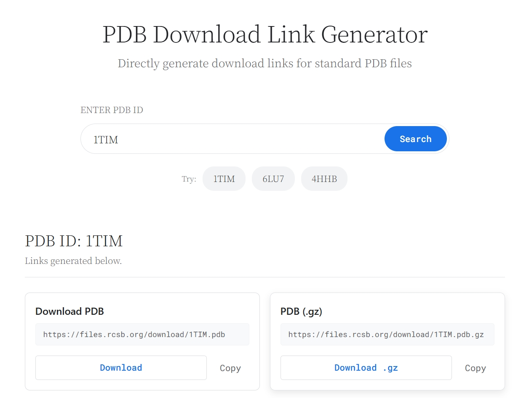

# Offline PDB Link Generator

A static web tool for structural biology researchers. Enter a PDB ID to instantly generate direct download links for structure files and related database pages.

---

## Preview



---

中文在此阅读：[中文文档](README_zh.md)

---

## Demo

https://pdbdownloader.netlify.app

---

## Running locally

### Requirements

- **Node.js**: 16.0.0 or higher
- **npm**: 7.0.0 or higher (or yarn/pnpm)

### Setup

1. Clone the repository

   ```bash
   git clone <repository-url>
   cd <project-folder>
   ```

2. Install dependencies

   ```bash
   npm install
   ```

3. Start the development server

   ```bash
   npm run dev
   ```

4. Build for production (optional)

   ```bash
   npm run build
   ```

### Notes

- Vite uses port 5173 by default—ensure it's available
- Modify `vite.config.js` to adjust configuration

---

## Project structure

```
├── public/          # Static resources
├── src/             # Source code
├── App.vue          # Root component
├── index.html       # Entry HTML
├── package.json     # Project configuration
└── vite.config.js   # Vite configuration
```

---

## Benefits

- **Offline & Private**: Runs entirely in your browser—no data leaves your device
- **Fast & Stable**: Immediate response without network latency
- **Research-Focused**: Direct access to molecular data speeds up your workflow

---

## Features

- **Instant Link Generation**: Complete URL set for any PDB ID
- **Multiple Formats**: PDB, mmCIF, XML files—and their compressed versions
- **Database Integration**: Direct links to RCSB PDB, PDBe, PDBsum, and UniProt
- **Responsive Design**: Works on desktop and mobile
- **One-Click Copy**: Copy any generated URL to clipboard instantly
